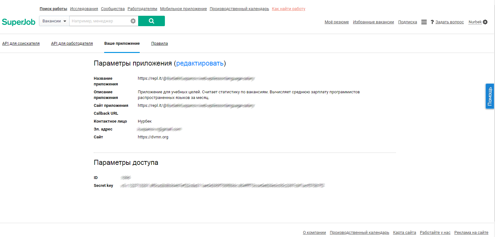

# Programming vacancies compare

The script shows average salary for popular programmer vacancies by 30 days

# How to start

Python3 should be already installed. Then use pip (or pip3, if there is a conflict with Python2) to install dependencies:

```bash
pip install -r requirements.txt
```

### Environment variables.

- TOKEN


.env example:

```
TOKEN=v3.r.122857201.8f0cg543b36467ef22c8a234ae54290f700f836c.804fhh73cce5e8hgyr7n5c2397cgtracf570b7f2
```
### How to get

* Register an application [API Superjob](https://api.superjob.ru/) and get the `Secret Key`:



### Run

Launch on Linux(Python 3.5) or Windows as simple

```bash

$ python main.py

# You will see

┌HeadHunter Moscow──────┬──────────────────┬─────────────────────┬──────────────────┐
│ Язык программирования │ Вакансий найдено │ Вакансий обработано │ Средняя зарплата │
├───────────────────────┼──────────────────┼─────────────────────┼──────────────────┤
│ Java                  │ 1745             │ 430                 │ 163728           │
│ C#                    │ 1088             │ 348                 │ 145706           │
│ Objective-C           │ 175              │ 52                  │ 179730           │
│ Python                │ 1369             │ 334                 │ 144901           │
│ C++                   │ 170              │ 84                  │ 129965           │
│ Go                    │ 366              │ 95                  │ 171563           │
│ Scala                 │ 183              │ 40                  │ 221327           │
│ PHP                   │ 1146             │ 552                 │ 118483           │
│ JavaScript            │ 2631             │ 799                 │ 136277           │
│ Typescript            │ 422              │ 153                 │ 164365           │
│ C                     │ 365              │ 199                 │ 127320           │
│ Swift                 │ 242              │ 81                  │ 175555           │
│ Ruby                  │ 205              │ 66                  │ 157121           │
└───────────────────────┴──────────────────┴─────────────────────┴──────────────────┘

┌SuperJob Moscow────────┬──────────────────┬─────────────────────┬──────────────────┐
│ Язык программирования │ Вакансий найдено │ Вакансий обработано │ Средняя зарплата │
├───────────────────────┼──────────────────┼─────────────────────┼──────────────────┤
│ JavaScript            │ 63               │ 30                  │ 120066           │
│ Java                  │ 20               │ 12                  │ 119220           │
│ Python                │ 14               │ 12                  │ 105778           │
│ Ruby                  │ 1                │ 1                   │ 175000           │
│ PHP                   │ 48               │ 17                  │ 107908           │
│ C++                   │ 26               │ 17                  │ 92056            │
│ C#                    │ 27               │ 18                  │ 119286           │
│ C                     │ 18               │ 9                   │ 94774            │
│ Go                    │ 0                │ 0                   │ 0                │
│ Objective-C           │ 2                │ 1                   │ 100000           │
│ Scala                 │ 0                │ 0                   │ 0                │
│ Swift                 │ 1                │ 0                   │ 0                │
│ Typescript            │ 5                │ 4                   │ 190000           │
└───────────────────────┴──────────────────┴─────────────────────┴──────────────────┘

```

# Project Goals

The code is written for educational purposes. Training course for web-developers - [DEVMAN.org](https://devman.org)
